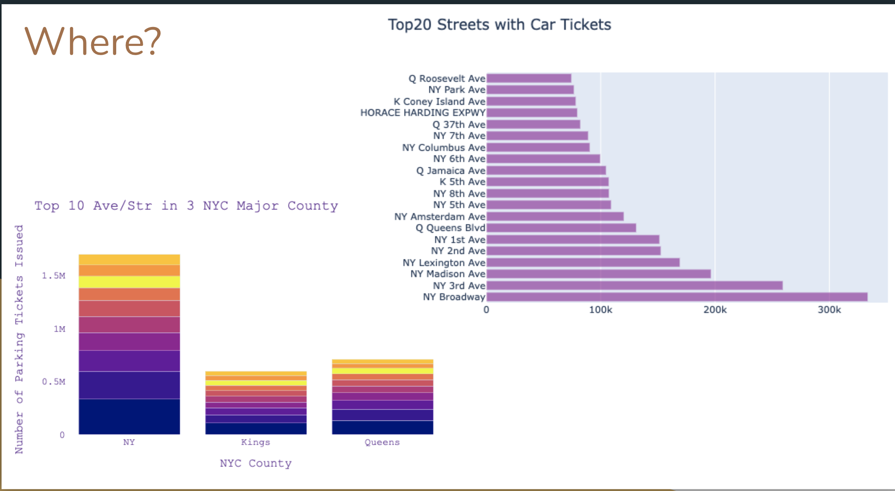
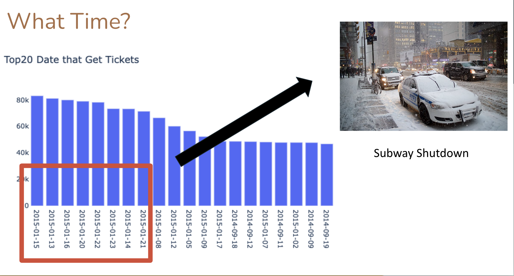
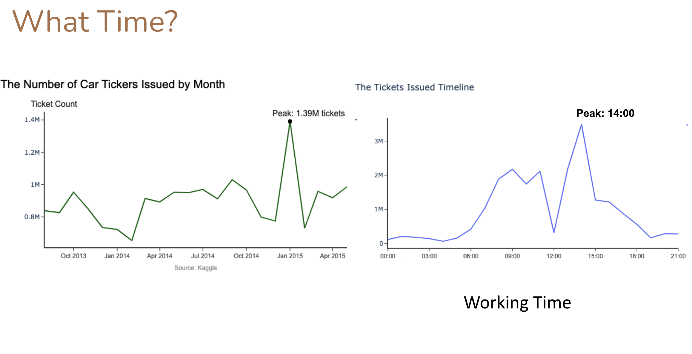
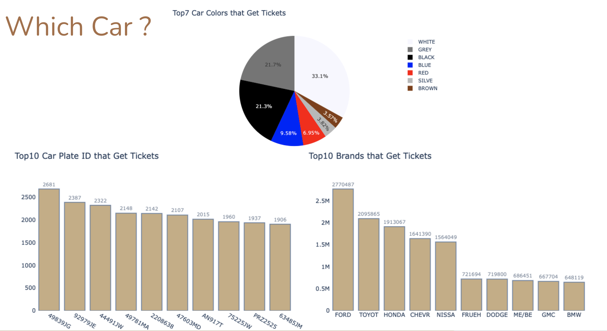
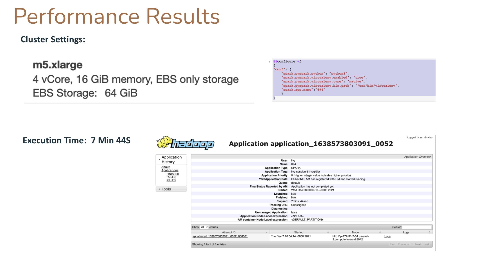

# New York Parking Tickets Analysis

In this project, we built a data pipeline to store and access data from **AWS S3** and processed data in **AWS EMR**. Then we used **Spark RDD** to analyze New York Parking tickets data set from different analytics goals. We used 5 instances **m5.xlarge** in EMR to process our raw data which supported us process data faster. All the Visualization is created by using Plotly which is interactive for the user to analyze if we open in a notebook mode.
```python
## load data in S3
data_path1 = "s3://msds694-project-renne/Parking_Violations_Issued_-_Fiscal_Year_2014__August_2013___June_2014_.csv"
data1 = sc.textFile(data_path1)
data_path2 = "s3://msds694-project-renne/Parking_Violations_Issued_-_Fiscal_Year_2015.csv"
data2 = sc.textFile(data_path2)
data = data1.union(data2)
data = data.map(lambda x: x.split(',')).map(lambda x: (x[1:3]+[x[4]]+x[6:8]+[x[19]]+[x[24]]+x[31:34]+[x[35]]+[x[21]]+[x[12]]+[x[5]]))

```
## Data Analytics Goal
When, where, and which car the police are likely to issue tickets?  

What are the major reasons for the cars to be stickered?

## Highlighted Visualization


```python
# add layout
layout = Layout(
    paper_bgcolor='rgba(0,0,0,0)',
    plot_bgcolor='rgba(0,0,0,0)'
)
fig = go.Figure(layout=layout)

# add 3 trace
fig.add_trace(go.Bar(
    y=Top10_street_count_table_NY['_3'],
    x=Top10_street_count_table_NY['_2'],
    name='NY',
    text = Top10_street_count_table_NY['_1'],
    marker=dict(
        color=sorted(px.colors.sequential.Plasma)
    )
))

fig.add_trace(go.Bar(
    y=Top10_street_count_table_K['_3'],
    x=Top10_street_count_table_K['_2'],
    name='Kings County',
    text = Top10_street_count_table_K['_1'],
    marker=dict(
        color=sorted(px.colors.sequential.Plasma)
    )
))

fig.add_trace(go.Bar(
    y=Top10_street_count_table_Q['_3'],
    x=Top10_street_count_table_Q['_2'],
    text = Top10_street_count_table_Q['_1'],
    name='Queen',
    marker=dict(
        color=sorted(px.colors.sequential.Plasma)
    )
))

fig.update_layout(barmode='stack')  # stack mode:['stack', 'group', 'overlay', 'relative']

fig.update_layout(
    title="Top 10 Ave/Str in 3 NYC Major County",
    xaxis_title="NYC County",
    yaxis_title="Number of Parking Tickets Issued",
    showlegend=False,
    font=dict(
        family="Courier New, monospace",
        size=14,
        color="RebeccaPurple"
    )
)

fig.show()
```

  

## Data 
Source: https://www.kaggle.com/new-york-city/nyc-parking-tickets 

Data Size: 4.66GB 

Format: CSV 

Time Window: August 2013 - September 2015

## The Presentation
Check it out! [Presentation](https://docs.google.com/presentation/d/10rxM-bq8BBPapIvF6vK8_OXs5WATZWqw8EYWeXzEdus/edit?usp=sharing)

